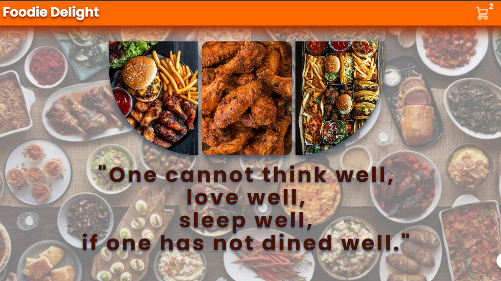
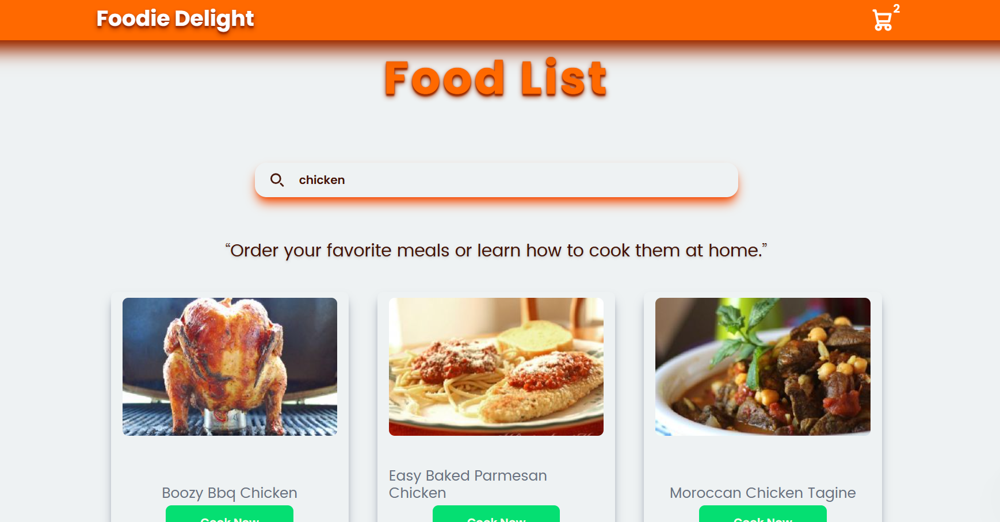
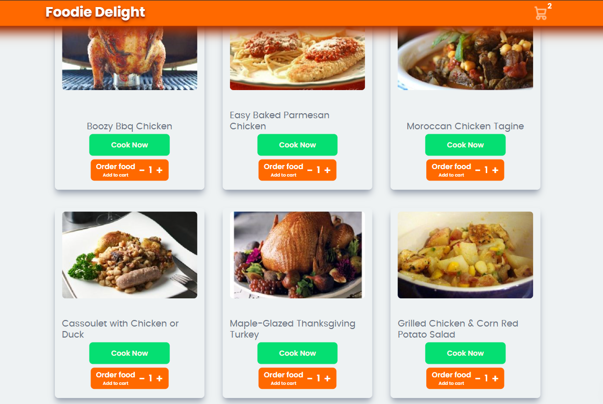
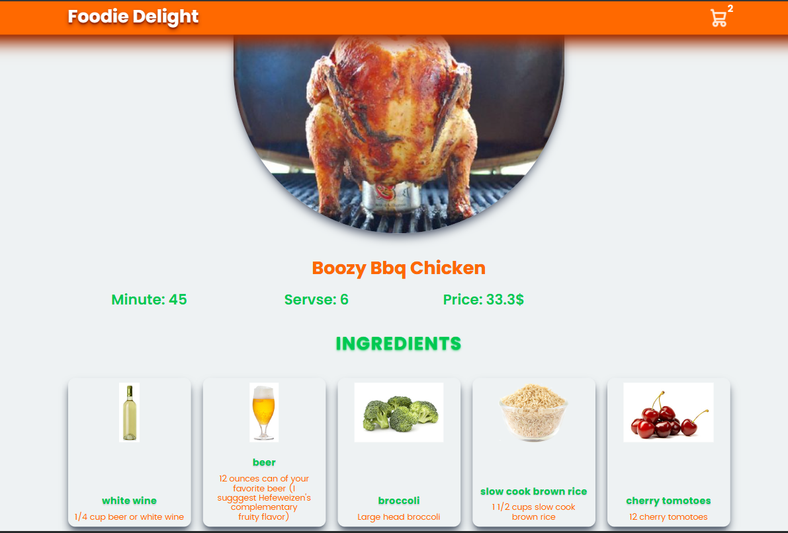
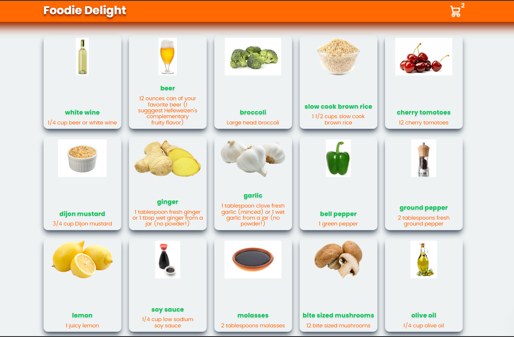
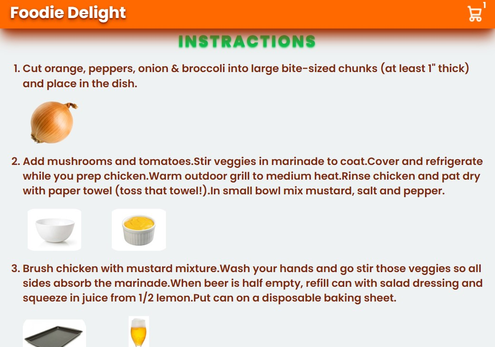
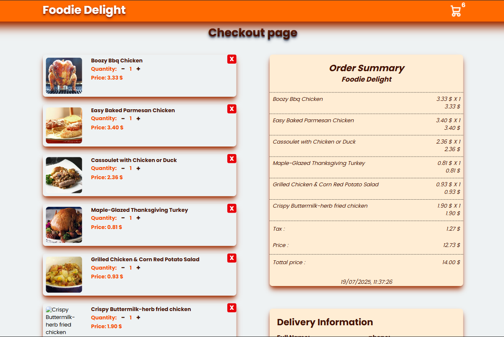
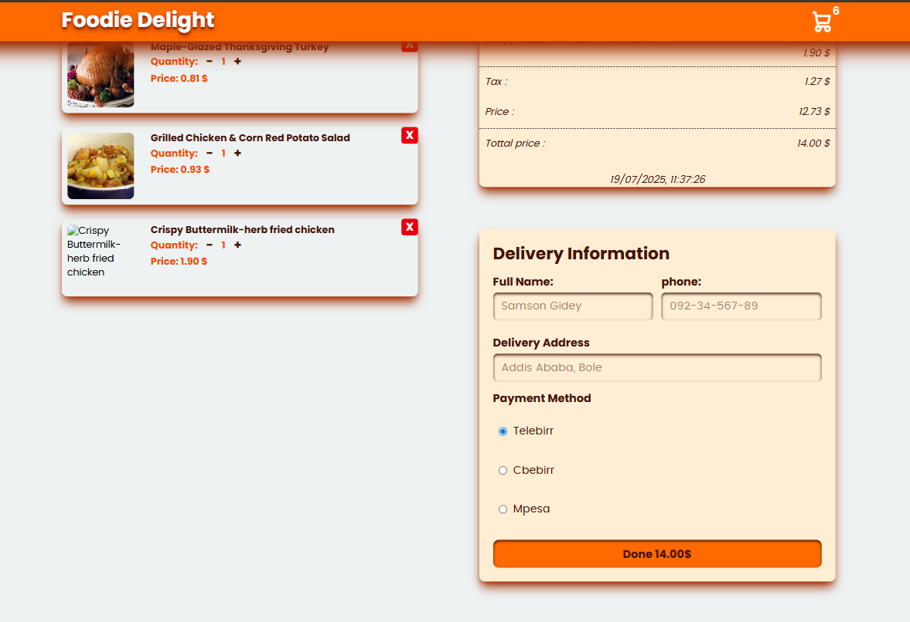

# 🍽️ Foodie Delight

**Foodie Delight** is a modern, responsive web application that helps users discover and now **order** delicious meals from around the world. Whether you're in the mood for pasta, dessert, or something brand new, Foodie Delight lets you search, explore, and order with ease.

## 🔥 Features

- 🔍 **Search any recipe** by name
- 🖼️ Clean and responsive **recipe card layout**
- 📄 **Detailed recipe pages** with ingredients and instructions
- 🛒 **Add to cart** functionality
- 🧾 **Cart summary and order receipt**
- 💳 **Order and payment simulation** (demo)
- 🌐 Built with **React**, **Tailwind CSS**, and **React Router**
- 📱 Fully responsive design for both desktop and mobile devices

## 🧪 New Ordering Features

- ✅ Users can select a recipe and **add it to their cart**
- 🛍️ **View and manage cart** items with quantity adjustment
- 📦 **Checkout with delivery information and payment options**
- 💡 Simulated payment options: **Telebirr**, **CBE Birr**, **Mpesa**

> 🔒 Note: This app simulates ordering — no real transactions are processed.

## 🚀 Live Demo

[👉 View Live](https://foodiedelightapp.netlify.app/)

## 🛠️ Tech Stack

- **React** – Frontend library
- **Tailwind CSS** – Utility-first styling
- **React Router DOM** – Client-side routing
- **Spoonacular API** – Meal and recipe data
- **Local Storage** – Persist cart items across reloads

## 📷 Screenshots

### 🏠 Home Page

### 📋 Recipe Details

### 🧾 Recipe Cards

### 🧂 Ingredients View

### 📦 Ingredient Card

### 🔢 Ordered Ingredient List

### 🛒 Cart Page

### 💳 Payment Page

