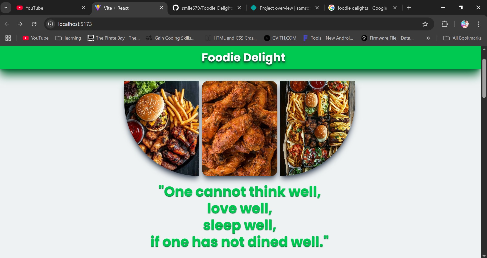
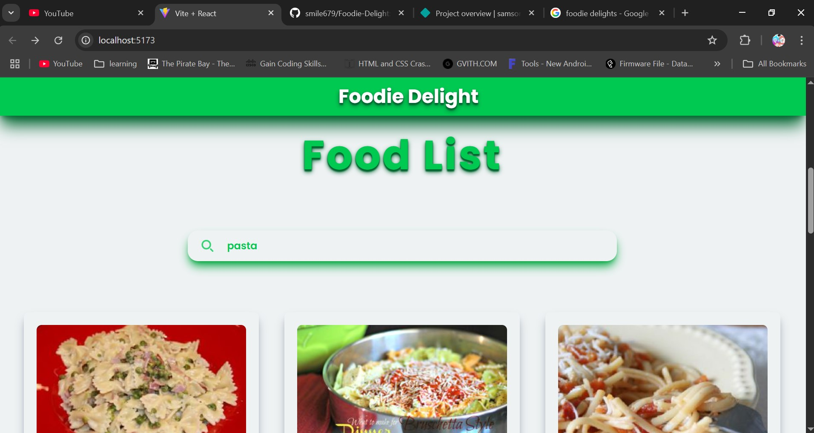
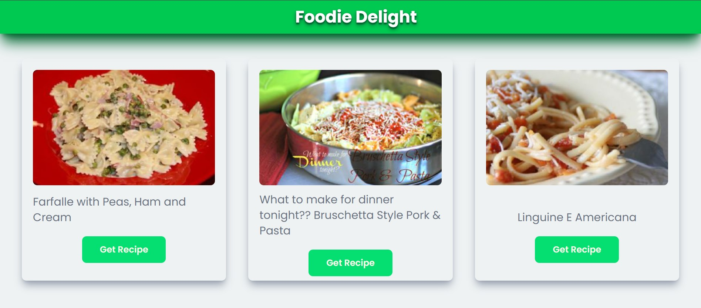
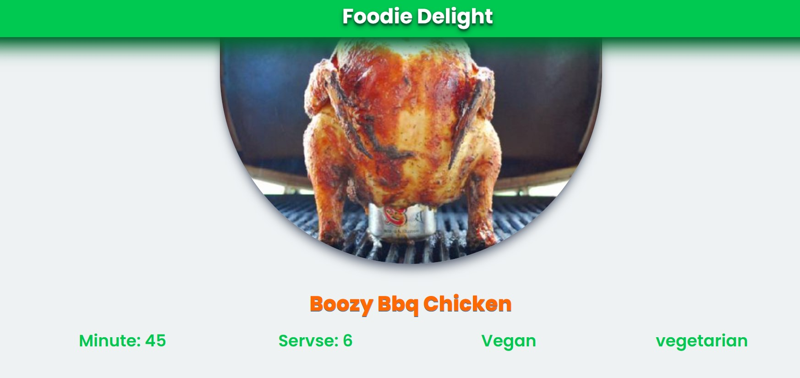
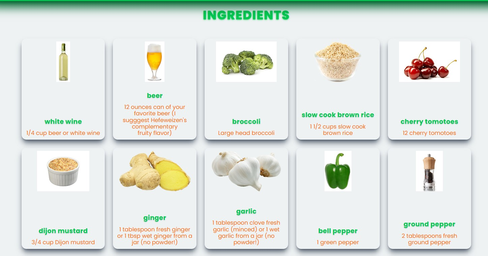
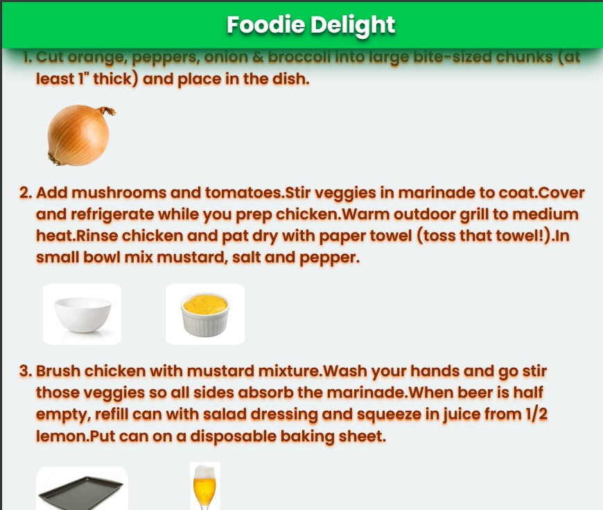

# 🍽️ Foodie Delight

**Foodie Delight** is a modern and responsive web application that helps users discover recipes from around the world. Whether you're craving pasta, dessert, or something new, you can search and explore a variety of meals with ease.

## 🔥 Features

- 🔍 **Search any recipe** by name
- 🖼️ Clean and responsive **recipe card layout**
- 📄 **Detailed recipe pages** with ingredients and instructions
- 🌐 Built with **React**, **Tailwind CSS**, and **React Router**
- 📱 Fully responsive design for desktop and mobile

## 🚀 Live Demo

[👉 View Live](https://foodiedelightapp.netlify.app/)

## 🛠️ Tech Stack

- **React** – Frontend library
- **Tailwind CSS** – Styling
- **React Router DOM** – Page navigation
- **API** – (spoonacular)

## 📷 Screenshots

  

